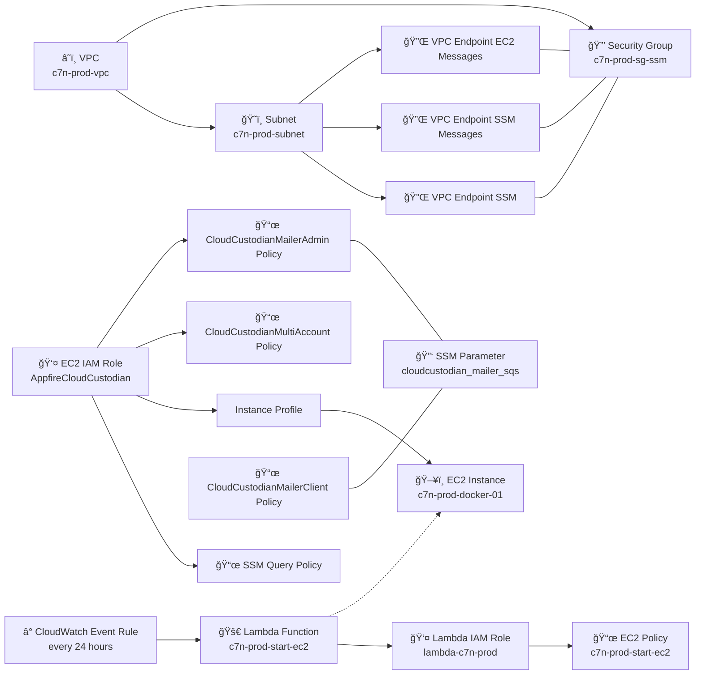

# Cloud Custodian Terraform Setup

## Architecture Diagram

```mermaid
flowchart LR
  vpc["â˜ï¸ VPC <br> c7n-prod-vpc"]
  subnet["ğŸ˜ï¸ Subnet <br> c7n-prod-subnet"]
  sg["🔒 Security Group <br> c7n-prod-sg-ssm"]

  vpc_ssm["🔌 VPC Endpoint SSM"]
  vpc_ssm_messages["🔌 VPC Endpoint SSM Messages"]
  vpc_ec2messages["🔌 VPC Endpoint EC2 Messages"]

  iam_role_ssm["👤 EC2 IAM Role <br> AppfireCloudCustodian"]
  iam_policy_ssm["📜 SSM Query Policy"]
  instance_profile["Instance Profile"]

  iam_policy_appfire["📜 CloudCustodianMultiAccount Policy"]
  iam_policy_mailer_admin["📜 CloudCustodianMailerAdmin Policy"]
  iam_policy_mailer_client["📜 CloudCustodianMailerClient Policy"]

  ec2_instance["ğŸ–¥ï¸ EC2 Instance <br> c7n-prod-docker-01"]

  iam_role_lambda["👤 Lambda IAM Role <br> lambda-c7n-prod"]
  iam_policy_ec2["📜 EC2 Policy <br> c7n-prod-start-ec2"]
  lambda_function["🚀 Lambda Function <br> c7n-prod-start-ec2"]

  cw_event_rule["â° CloudWatch Event Rule <br> every 24 hours"]

  ssm_param_mailer["🔑 SSM Parameter <br> cloudcustodian_mailer_sqs"]

  %% Connections
  vpc --> subnet
  vpc --> sg

  subnet --> vpc_ssm
  subnet --> vpc_ssm_messages
  subnet --> vpc_ec2messages

  vpc_ssm --- sg
  vpc_ssm_messages --- sg
  vpc_ec2messages --- sg

  iam_role_ssm --> iam_policy_ssm
  iam_role_ssm --> instance_profile
  instance_profile --> ec2_instance

  iam_role_ssm --> iam_policy_appfire
  iam_role_ssm --> iam_policy_mailer_admin

  %% SSM parameter used in mailer policies
  iam_policy_mailer_admin --- ssm_param_mailer
  iam_policy_mailer_client --- ssm_param_mailer

  iam_role_lambda --> iam_policy_ec2
  lambda_function --> iam_role_lambda

  cw_event_rule --> lambda_function

  %% Lambda uses EC2 instance id in its environment
  lambda_function -.-> ec2_instance
```