## Tagging Control Reference

### Repository Layout
```
cloud-custodian-infra/
├── README.md
├── terraform/
│   ├── main.tf
│   ├── providers.tf
│   ├── variables.tf
│   ├── lambda.js
│   ├── lambda.zip
│   └── modules/
│       ├── c7n/
│       │   ├── main.tf
│       │   ├── variables.tf
│       │   └── outputs.tf
│       └── deployment/
│           ├── main.tf
│           ├── variables.tf
│           └── outputs.tf
└── docs/  
    └── architecture.md  
```

## IAM Permissions

### All Roles
- **Policies**
  - `ReadOnlyAccess`
  - `ResourceGroupsandTagEditorFullAccess`
  - `ResourceGroupsTaggingAPITagUntagSupportedResources`
  - `CloudCustodianMailerClient` (self-managed)
- **Trust**
  - Principal: `arn:aws:iam::ACCOUNT_ID:role/CloudCustodian`

### CloudCustodian Role
- **Policies**
  - `CloudCustodianMultiAccount` (self-managed)
  - `CloudCustodianMailerAdmin` (self-managed)
- **Trust**
  - Principal: itself (`sts:AssumeRole`)

## Self-Managed IAM Policies

### `CloudCustodianMultiAccount`
```json
{
  "Version":"2012-10-17",
  "Statement":[
    {
      "Effect":"Allow",
      "Action":"sts:AssumeRole",
      "Resource":"arn:aws:iam::*:role/AppfireCloudCustodian"
    }
  ]
}
```

### `CloudCustodianMailerClient`
```json
{
  "Version":"2012-10-17",
  "Statement":[
    {
      "Effect":"Allow",
      "Action":["sqs:SendMessage"],
      "Resource":"arn:aws:sqs:us-east-2:891377226793:cloudcustodian-mailer"
    }
  ]
}
```

### `CloudCustodianMailerAdmin`
```json
{
  "Version":"2012-10-17",
  "Statement":[
    {
      "Effect":"Allow",
      "Action":["sqs:DeleteMessage","sqs:ReceiveMessage","sqs:SendMessage"],
      "Resource":"arn:aws:sqs:us-east-2:891377226793:cloudcustodian-mailer"
    }
  ]
}
```

## Deployment

### Components
- **EventBridge Rule**: schedules Lambda
- **Lambda (Start EC2)**: `StartInstances` API
- **EC2 Instance**: runs Docker-hosted Cloud Custodian; shuts down post-run

### Workflow
1. EventBridge → Lambda
2. Lambda starts EC2
3. EC2 launches Docker container
4. Container executes `c7n-pipeline`
5. EC2 shuts down

### Architecture Diagram

```mermaid
flowchart LR
  vpc["☁️ VPC <br> c7n-prod-vpc"]
  subnet["🏘️ Subnet <br> c7n-prod-subnet"]
  sg["🔒 Security Group <br> c7n-prod-sg-ssm"]

  vpc_ssm["🔌 VPC Endpoint SSM"]
  vpc_ssm_messages["🔌 VPC Endpoint SSM Messages"]
  vpc_ec2messages["🔌 VPC Endpoint EC2 Messages"]

  iam_role_ssm["👤 EC2 IAM Role <br> AppfireCloudCustodian"]
  iam_policy_ssm["📜 SSM Query Policy"]
  instance_profile["Instance Profile"]

  iam_policy_appfire["📜 CloudCustodianMultiAccount Policy"]
  iam_policy_mailer_admin["📜 CloudCustodianMailerAdmin Policy"]
  iam_policy_mailer_client["📜 CloudCustodianMailerClient Policy"]

  ec2_instance["🖥️ EC2 Instance <br> c7n-prod-docker-01"]

  iam_role_lambda["👤 Lambda IAM Role <br> lambda-c7n-prod"]
  iam_policy_ec2["📜 EC2 Policy <br> c7n-prod-start-ec2"]
  lambda_function["🚀 Lambda Function <br> c7n-prod-start-ec2"]

  cw_event_rule["⏰ CloudWatch Event Rule <br> every 24 hours"]

  ssm_param_mailer["🔑 SSM Parameter <br> cloudcustodian_mailer_sqs"]

  %% Connections
  vpc --> subnet
  vpc --> sg

  subnet --> vpc_ssm
  subnet --> vpc_ssm_messages
  subnet --> vpc_ec2messages

  vpc_ssm --- sg
  vpc_ssm_messages --- sg
  vpc_ec2messages --- sg

  iam_role_ssm --> iam_policy_ssm
  iam_role_ssm --> instance_profile
  instance_profile --> ec2_instance

  iam_role_ssm --> iam_policy_appfire
  iam_role_ssm --> iam_policy_mailer_admin

  %% SSM parameter used in mailer policies
  iam_policy_mailer_admin --- ssm_param_mailer
  iam_policy_mailer_client --- ssm_param_mailer

  iam_role_lambda --> iam_policy_ec2
  lambda_function --> iam_role_lambda

  cw_event_rule --> lambda_function

  %% Lambda uses EC2 instance id in its environment
  lambda_function -.-> ec2_instance
```



## Credentials

| Credential            | Storage                      | Retrieval                     |
|-----------------------|------------------------------|-------------------------------|
| Docker pull creds     | SSM Parameter Store          | At container start            |
| Slack webhook URL     | SSM Parameter Store          | At container start            |
| AWS credentials       | IAM instance profile or SSM  | At EC2 launch                 |

## Terraform Modules

### `modules/c7n`
- **Variables**
  - `account_list_file` (string)
  - `policy_file` (string)
- **Outputs**
  - `lambda_arn`
  - `sqs_queue_url`

### `modules/deployment`
- **Variables**
  - `ec2_instance_type` (string)
  - `schedule_cron` (string)
- **Outputs**
  - `eventbridge_rule_arn`
  - `lambda_start_ec2_arn`

## Cloud Custodian Container

- **Entrypoint**: `entrypoint.sh` (fetches SSM secrets)
- **Default CMD**: invokes `c7n-pipeline.sh`
- **Config**: policies, account list, notification templates passed via ENV

## Accounts & Policies Management

- **Accounts File**
  - *Static*: maintained manually
  - *Dynamic*: generated at run-time
- **Policies File**
  - Single manifest; recommend generator tool to produce per-resource/tag schemas

## Slack Notification Templates

- **non_compliant**: action required
- **compliant**: resource meets policy
- **deleted**: resource removed after non-compliance period

## Pending Tasks
- [ ] Implement dynamic account-list generator
- [ ] Configure Docker image registry (Docker Hub/ECR)
- [ ] Decide deployment account boundary
- [ ] Validate Terraform with `terraform validate` / `plan`
- [ ] Provision SSM parameters for secrets
- [ ] Create Slack app for webhooks